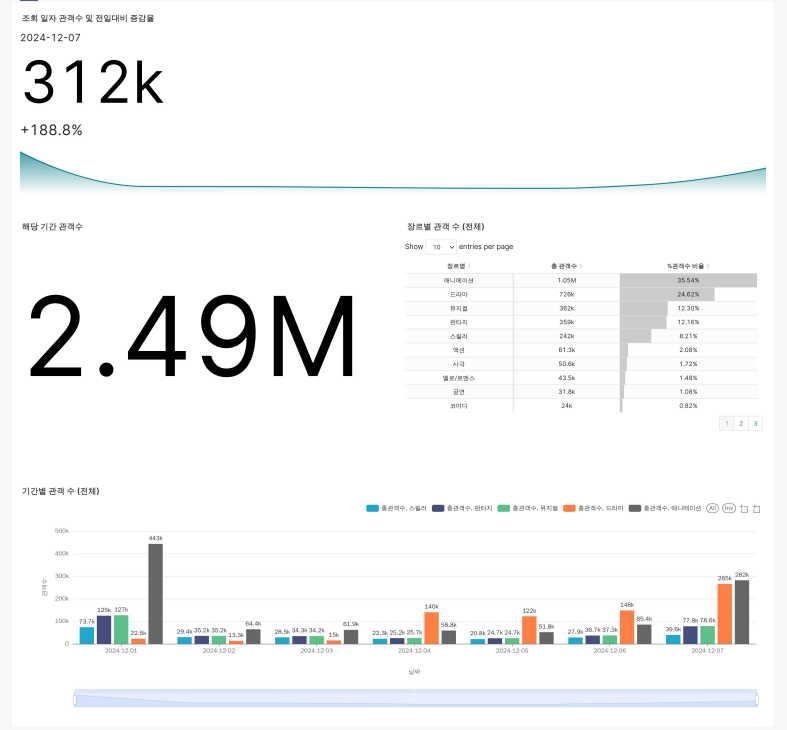

# 데이터 웨어하우스를 이용한 대시보드 구성
## 주제: 영화 트렌드 대시보드
## Programmers 데브코스 Data Engineering 5기 
- <b>Team</b>`1잘하조`
  - <b>김동환 `영화별 매출액,전날 관객수 데이터 수집` `ETL` `대시보드 시각화`</b>
  - <b>윤대열 `상영관 별 관객 수 데이터 수집` `ETL` `대시보드 시각화`</b>
  - <b>이상원 `장르별(+기간) 관객 수 데이터 수집` `ETL` `대시보드 시각화`</b>
  - <b>설연수 `기간(연간,월간,주간 등)별 관객 수 데이터 수집` `ETL` `대시보드 시각화`</b>
  - <b>김유빈 `배우별 인지도 데이터 수집` `ETL` `대시보드 시각화`</b>
- **프로젝트 진행 기간**: 2025.01.06 ~ 2025.01.09

## 목차
###### 1. 프로젝트 개요
###### 2. 활용 기술
###### 3. 프로젝트 결과 및 세부내용
###### 4. 프로젝트 결론

## 1. 프로젝트 개요
### 프로젝트 주제 선정
영화 산업은 문화와 경제에 큰 영향을 미치는 분야로, 끊임없이 변화하는 관객의 선호도와 트렌드를 분석하는 것이 중요합니다.
  
최근 OTT 플랫폼의 확산, 특정 장르의 인기도 변화 등 영화 시장의 복잡성이 증가하며,
  
데이터 기반 의사 결정의 필요성이 커지고 있기에 이번 주제를 기획하게 되었습니다.
  
### 프로젝트 주요 목표
- AWS S3, Redshift, Superset(Preset) 등 최신 클라우드 및 데이터 시각화 기술을 활용
- 대용량 데이터의 분석
- 직관적이고 유용한 대시보드 시스템 구축

### 기술적 목표
- 웹크롤링, OPEN API를 이용하여 데이터 수집
- AWS S3에 데이터 적재 및 전처리
- Redshift에 COPY하여 사용 및 이해
- Superset(Preset)을 사용하여 Chart 작성 및 Dashboard 제작하여 데이터 시각화

## 2. 활용 기술 
### 데이터 소스
> [KOFIC 영화관 입장권 통합전산망 :: 일별 박스오피스](https://www.kobis.or.kr/kobis/business/stat/boxs/findDailyBoxOfficeList.do)

> [KOBIS OPEN API 서비스](https://www.kobis.or.kr/kobisopenapi/homepg/main/main.do)

### 데이터 수집
`Python` `Selenium` `Requests`

### 데이터 처리
`pywin32` `Pandas`

### 데이터 적재
`AWS S3` `AWS Redshift` `boto3` `Python Schedule`

### 데이터 시각화
`Preset`

### 협업 Tools
`Github` `Slack` `Zep` `Notion`

## 3. 프로젝트 결과 및 세부내용
 

### 영화 별 매출액, 전날 관객 수

### 장르 별(+기간) 관객 수

### 상영관 별 관객 수

### 기간(연간,월간,주간) 별 관객 수

### 배우별 인지도

## 4. 프로젝트 결론

### 기대효과
- **시장 트렌드 분석**
  
  `매출액과 관객 수 데이터를 통해 인기 영화와 흥행 요인 분석 가능`
  
- **운영 효율화**
  
  `상영관 별 관객 수 데이터를 통해 상영 스케줄 최적화 및 자원 배분 개선`

- **마케팅 전략 수립**
  
  `배우별 인지도와 관련 데이터 활용하여 홍보 및 캐스팅 전략 수립`
  
  `전날 관객 수 데이터를 기반으로 변동성 감지하여 광고 캠페인 조정 가능`

- **데이터 기반 의사결정 촉진**
  
  `모든 데이터를 통합적으로 분석하여 데이터 중심의 의사결정을 촉진하고,`
  
  `결과적으로 영화 산업의 경쟁력을 높이는 데 기여할 수 있다.`

### 개선점
- 이번 프로젝트에서 추출한 데이터의 크기가 크지 않아 CSV로 저장을 했지만 향후 데이터 량이 커지면

  parquet이나 avro 파일로 저장하는 것을 검토하는 것도 좋을 것 같습니다.
- 팀원 1분이 맡은 부분이 전날 관객수 데이터를 추출해야해서 주기적으로 데이터를 수집을 해야 했지만
  
  다른 부분도  주기적으로 데이터를 수집하면 프로젝트를 고도화 할 수 있을 것 같습니다.
- 전날 관객수 데이터를 매일 업데이트하는 과정에서 파이썬의 schedule 라이브러리를 사용했는데
  
  AWS lambda 또는 Airflow를 사용해서 할 수 있으면 더 좋을 것 같습니다.
=======
# **데이터 웨어하우스를 이용한 대시보드 구성 프로젝트**

- **프로젝트 진행 기간**: 2025.01.06 ~ 2025.01.09

- **역활**: 장르 (+기간) 별 데이터 시각화

###  **장르 (+기간) 별 대시보드**

### **src 폴더 구조**

|
Folder
|
Info
|
|----------|--------|
|
code
|
일별 데이터 수집/처리 및 Redshift 적재 코드.
|
|
data
|
수집된 데이터가 있는 .csv 파일들
|
|
config
|
RedShift 연결시 필요한 Parameter 수록. Parameter 값들은 실행시 추가 필요.
|
|
xls_files
|
Selenium를 통해 저장한 파일 저장 장소
|
|
xlsx_files
|
xls에서 xlsx로 변환된 파일 저장 장소
|
|
img
|
스크린 샷 저장 장소
|
>>>>>>> sangwon
